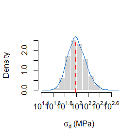
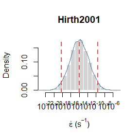
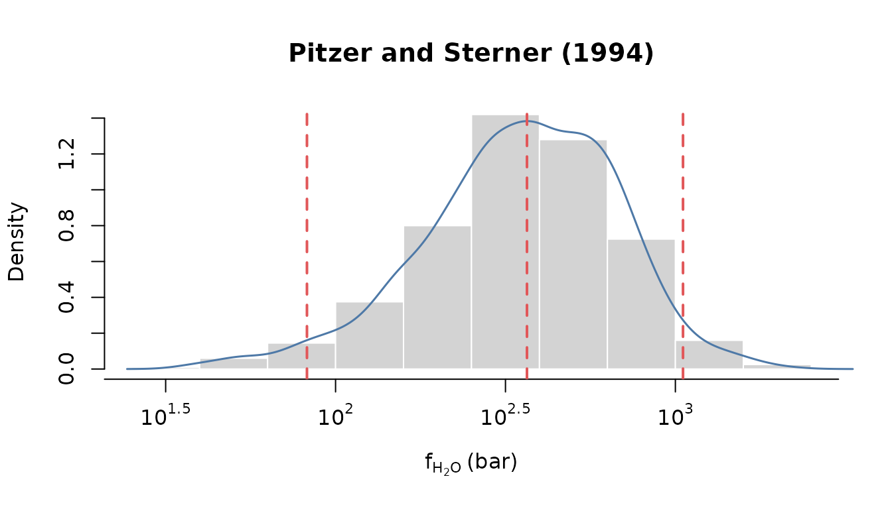
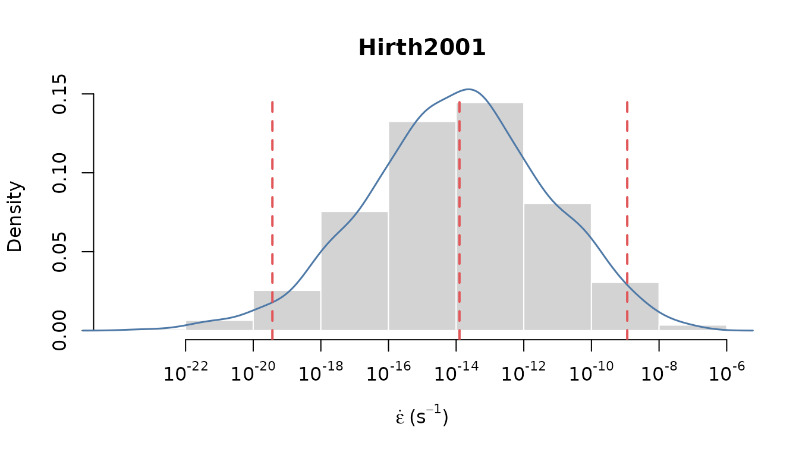
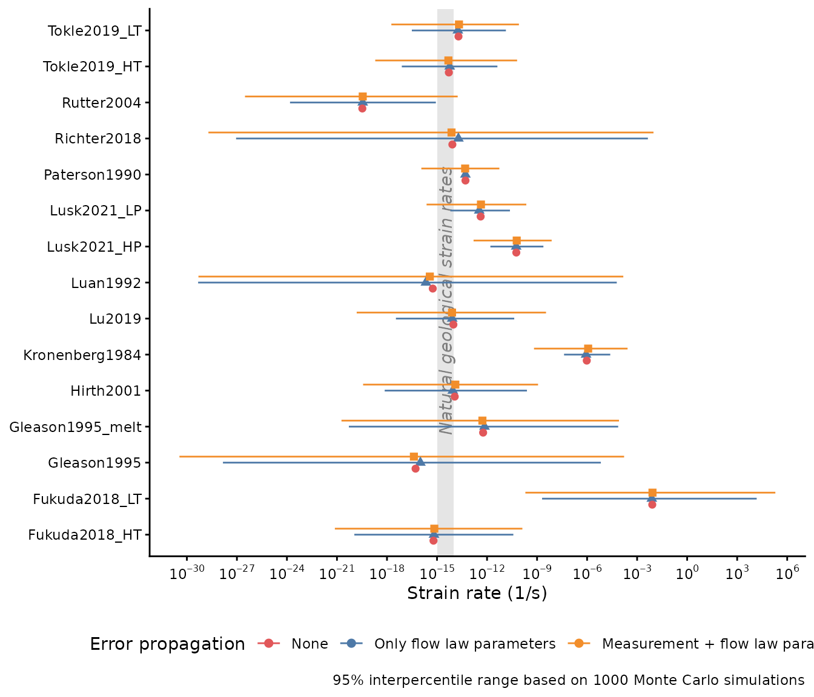

# Flow law sensitivity analysis

``` r
library(geocreep)
library(ggplot2)
library(dplyr)
library(scales)
theme_set(theme_classic())
```

Define initial grainsize, temperature and pressure:

``` r
grainsize <- units::set_units(11, um)
stress0 <- grainsize_piezometry(grainsize, propagate_err = FALSE)
temperature <- units::set_units(300, degC)
pressure <- units::set_units(400, MPa)
fugacity <- ps_fugacity(pressure, temperature)

models <- c("Hirth2001", "Paterson1990", "Kronenberg1984", "Luan1992", "Gleason1995", "Gleason1995_melt", "Rutter2004", "Fukuda2018_LT", "Fukuda2018_HT", "Richter2018", "Lu2019", "Tokle2019_LT", "Tokle2019_HT", "Lusk2021_LP", "Lusk2021_HP")
```

## No error propagation

``` r
edot_estimates0 <- sapply(models,
       function(m){
         disl_creep_quartz(stress = stress0, temperature = temperature, fugacity = fugacity, pressure = pressure, grainsize = grainsize, model = m, propagate_err = FALSE)
       }) |> 
  setNames(models) |> 
  t() |> 
  t() |> 
  as.data.frame() |> 
  rename(`50%` = V1)

edot_estimates0$model <- models
edot_estimates0$error <- 'none'
```

## Only error propagation of flow law uncertainties

Specify the amount of Monte Carlo (MC) simulations:

``` r
n <- 1e3
```

Recalculate stress using MC simulations:

``` r
stress1 <- grainsize_piezometry(grainsize, sim = n)
```

### Distribution of differential stress

Visualize the calculated stress estimates:

``` r
stress_log <- log10(as.numeric(stress1))

hist(stress_log, xlab = bquote(sigma[d] ~ '(MPa)'), main = NULL, freq = FALSE, xaxt ='n', border = 'white')
ticks <- seq(1.4, 2.6, .2)
labels <- sapply(ticks, function(i) as.expression(bquote(10^.(i))))
axis(1, at = ticks, labels = labels)

lines(density(stress_log), lwd = 1.5, col = 'dodgerblue3', xpd = TRUE)
abline(v = median(stress_log), lty = 2, lwd = 2, col = 'red')
```



Calculate the strain rates using the stress estimates:

``` r
edot_estimates1 <- lapply(models,
       function(m){
         disl_creep_quartz(stress = median(stress1), temperature = temperature, fugacity = fugacity, pressure = pressure, grainsize = grainsize, model = m, sim = n)
       }) |> 
  setNames(models)
```

### Distribution of strain rate

Visualize the strain rate estimates:

``` r
m <- 'Hirth2001'
edot_log <- log10(as.numeric(edot_estimates1[[m]]))

hist(edot_log, xlab = bquote(dot(epsilon) ~ '('* s^{-1} * ')'), main = m, freq = FALSE, xaxt ='n', border = 'white')

ticks <- seq(-22, -6, 2)
labels <- sapply(ticks, function(i) as.expression(bquote(10^.(i))))
axis(1, at = ticks, labels = labels)

lines(density(edot_log), lwd = 1.5, col = '#4E79A7', xpd = TRUE)
abline(v = quantile(edot_log, probs =c( .025, .5, .975)), lty = 2, lwd = 2, col = '#E15759')
```



``` r
edot_quantiles1 <- sapply(edot_estimates1, function(x){
  qs <- quantile(x, probs = c(.025, .5, .975))
  m <- exp(mean(log(x)))
  c(qs, mean = m)
}) |> 
  t() |> 
  as.data.frame()

#edot_quantiles1$model <- reorder(factor(models), edot_quantiles1$`50%`)\
edot_quantiles1$model <- models
edot_quantiles1$error <- 'only flow law'
```

## Error propagation of flow law uncertainties and measurement errors

Now we add some uncertainties to our temperature and pressure estimates,
and then recaclulate the fugacity:

(this may take a while…)

``` r
temperature2 <- units::set_units(rnorm(n, temperature, 50), degC)
pressure2 <- units::set_units(rnorm(n, pressure, 100), MPa)
fugacity2 <- ps_fugacity(pressure2, temperature2, future.seed = TRUE)
```

### Distribution of fugacity values

Visualize the distribution of the recalculated fugacity values:

``` r
fug_bar <- log10(as.numeric(fugacity2))

hist(fug_bar, xlab = bquote('f'['H'[2]*'O']~ '(bar)'), main = 'Pitzer and Sterner (1994)', freq = FALSE, xaxt ='n', border = 'white')

ticks <- seq(1, 4, .5)
labels <- sapply(ticks, function(i) as.expression(bquote(10^.(i))))
axis(1, at = ticks, labels = labels)

lines(density(fug_bar), lwd = 1.5, col = '#4E79A7', xpd = TRUE)
abline(v = quantile(fug_bar, probs =c( .025, .5, .975)), lty = 2, lwd = 2, col = '#E15759')
```



Student’s T-test for normal distribution:

``` r
t.test(as.numeric(fugacity2)); t.test(log10(as.numeric(fugacity2)));
#> 
#>  One Sample t-test
#> 
#> data:  as.numeric(fugacity2)
#> t = 50.202, df = 999, p-value < 2.2e-16
#> alternative hypothesis: true mean is not equal to 0
#> 95 percent confidence interval:
#>  407.8368 441.0178
#> sample estimates:
#> mean of x 
#>  424.4273
#> 
#>  One Sample t-test
#> 
#> data:  log10(as.numeric(fugacity2))
#> t = 283.23, df = 999, p-value < 2.2e-16
#> alternative hypothesis: true mean is not equal to 0
#> 95 percent confidence interval:
#>  2.525727 2.560970
#> sample estimates:
#> mean of x 
#>  2.543349
```

### Distribution of strain rate values

Calculate strain rate values:

``` r
edot_estimates2 <- lapply(models,
       function(m){
         disl_creep_quartz(stress = stress1, temperature = temperature2, fugacity = fugacity2, pressure = pressure2, grainsize = grainsize, model = m, sim = n)
       }) |> 
  setNames(models)
```

Visualize the distribution of the new strian rate values:

``` r
m <- 'Hirth2001'
edot_log2 <- log10(as.numeric(edot_estimates2[[m]]))

hist(edot_log2, xlab = bquote(dot(epsilon) ~ '('* s^{-1} * ')'), main = m, freq = FALSE, xaxt ='n', border = 'white')

ticks <- seq(-22, -6, 2)
labels <- sapply(ticks, function(i) as.expression(bquote(10^.(i))))
axis(1, at = ticks, labels = labels)

lines(density(edot_log2), lwd = 1.5, col = '#4E79A7', xpd = TRUE)
abline(v = quantile(edot_log2, probs =c( .025, .5, .975)), lty = 2, lwd = 2, col = '#E15759')
```



``` r
edot_quantiles2 <- sapply(edot_estimates2, function(x){
  qs <- quantile(x, probs = c(.025, .5, .975))
  m <- exp(mean(log(x)))
  c(qs, mean = m)
}) |> 
  t() |> 
  as.data.frame()

edot_quantiles2$model <- models
edot_quantiles2$error <- 'all'
```

### Compare results

Finally, we compare the strain rate results calculated without any error
propagation, considering the errors in the flow laws, and the
uncertainties in the initial temperature and pressure values:

``` r
bind_rows(edot_quantiles1, edot_quantiles2, edot_estimates0) |> 
  mutate(#model = reorder(factor(model), `50%`),
         error = factor(error, levels = c('none', 'only flow law', 'all'))
         ) |> 
  ggplot(aes(x = `50%`, xmin = `2.5%`, xmax = `97.5%`, y = model, color = error)) +
  geom_rect(aes(xmin = 1e-15, xmax = 1e-14, ymin = -Inf, ymax = Inf), color = NA, fill = 'grey90') +
  annotate('text', x =  10^(-14.5), y = length(models)/2,  label = 'Natural geological strain rates', angle = 90, hjust = .5, vjust = .5, color = 'grey50', fontface = 3) +
  geom_linerange(position = position_dodge(width = 0.5, orientation = 'y')) +
  geom_point(aes(x = `50%`, shape = error), size = 2, position = position_dodge(width = 0.5, orientation = 'y')) +
  scale_x_log10('Strain rate (1/s)', breaks = breaks_log(n = 15), labels = label_log()) +
  scale_color_manual('Error propagation', 
                     values = c('all' = '#F28E2B', 'only flow law' = '#4E79A7', 'none' = '#E15759'), 
                     labels = c('all' = 'Measurement + flow law parameters', 'only flow law' = 'Only flow law parameters', 'none' = 'None')) +
  labs(y = NULL, caption = paste('95% interpercentile range based on', n, "Monte Carlo simulations")) +
  guides(shape = "none") +
  theme(legend.position = 'bottom')
```


